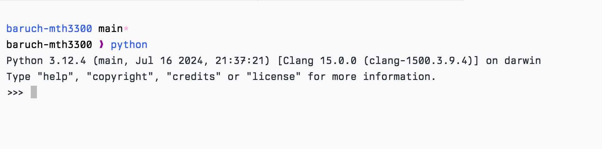

# Self-introductions

- I'm Jaime Abbariao
- Graduated from Baruch in 2017 and NYU in 2020
- Currently a software engineer at [Figma](https://www.figma.com) working on the user growth team

<!-- end_slide -->

# About this class

- We meet on Tuesday and Thursday at 5:40pm (unless Baruch is on one of those weird schedule)
- Class will be fast-paced as there's a lot of material to cover
  - If you do think that it's going way too fast, please tell me to slow down.
- We'll explore topics like REST APIs and even UI development with Python

<!-- end_slide -->

# Syllabus

Here is a link to the [syllabus online](https://www.jabbariao.com/baruch-mth3300/spr2025).

## Course grading

- Problem sets: 50%
- Midterm: 25%
- Final: 25%

If your final exam grade is higher than your midterm exam grade, then I'll substitute your final exam grade for your midterm grade.

Exams will generally be cumulative in nature because we're going to continue building your base knowledge throughout the semester.

### Grade breakdown

- A:  95-100
- A-: 90-94
- B+: 87-89
- B:  83-86
- B-: 80-82
- C+: 77-79
- C:  73-76
- C-: 70-72
- D:  65-69
- F:  0-64

<!-- end_slide -->

# Syllabus

## Problem sets

I just want to state some policies around our problem sets.

- Late submissions are penalized 5 points every 3 hours past the deadline.
  - Ex. If the deadline is 12am, but you submit at 6am, your max possible score is a 90 for the homework.
- All non-programming questions in problem sets should be typed up and submitted as a PDF.
- Feel free to collaborate on homework with your classmates, but you must note who in your homework submission.
  - We'll limit this to groups of 2!

## A note about the use of AI tools

It's inevitable that you may end up using AI to help you with your problem sets.

I really can't do much to stop you. Given that I use AI in my day job, it feels a bit hypocritical to tell you to stop.

To combat this, the midterm and final will be paper-based exams.

## Textbooks

**There is no official textbook.**

If you need a reference guide, then you should look into *Python Crash Course* by Eric Matthes.

<!-- end_slide -->

# Syllabus

## Contact

If you need to contact me about any questions or concerns, you can reach me at `jaimeabbariao@gmail.com`

Just make sure that you prepend your email subject with `MTH 3300`.

<!-- end_slide -->

# Tips for doing well in this class

- Practice everyday
  - You will not do well on the exams if you do not practice coding
- Ask questions early and often
- Collaborate with your classmates

<!-- end_slide -->

# What is programming?

Programming is the process of creating instructions that a computer can follow to perform specific tasks.

At its core, programming is about solving problems. Just like you might use a recipe to bake a cake, you use programming to solve
problems, automate tasks, or create applications.

Since computers understand binary, we need programming languages to allow us to write instructions in a more human-readable form which
are then translated to binary for the computer to execute.

In this class we'll use the Python programming language.

<!-- end_slide -->

# Introduction to Python

Python was created by Guido van Rossum and released to the public in 1991.

Python has positioned itself as a great introductory programming language for the following reasons:

- **Ease of learning**: Python has a simple and readable syntax which is designed to be easy to understand and write.
- **Relevance**: Python is widely used in the industry.
- **Enforces good habits**: Python encourages good programming practices like readability and simplicity

<!-- end_slide -->


# Introduction to Python

## A first look

Here's our canonical introduction to Python!

```python
def hello_world():
    print("Hello, world!")

hello_world() # Outputs: "Hello, world!"
```

The above code snippet creates a function called `hello_world` and when we call this function, we end up printing the string "Hello, world!" to the console!

<!-- end_slide -->

# Installing Python

This class requires that we have at least python@3.10

## For MacOS users

If you don't already have Homebrew, please following the instructions on the [site](https://docs.brew.sh/Installation) to install it.

```bash
brew install python@3.12
```

Run the following command to make sure that you've successfully installed the correct version

```bash
python --version
```

## For Windows users

Visit the [official download page](https://www.python.org/downloads/) and download Python 3.12

Run the installer and make sure to add Python to your path.

Run the following command to make sure that you've successfully installed the correct version

```bash
python --version
```

## For Linux users

You most likely already have Python installed or are capable of figuring this out for yourself

<!-- end_slide -->

# Code editors

Here are a list of code editors that I would recommend for beginners:

- [Visual Studio Code](https://code.visualstudio.com/) (**recommended**)
- [PyCharm](https://www.jetbrains.com/pycharm/)
- [Zed](https://zed.dev/)
- [neovim](https://neovim.io/)

For those that want a simple setup, VSCode will be enough.

**NOTE**: I do prefer students to use code editors over Jupyter notebooks because you will need to upload actual Python files for your assignments

<!-- end_slide -->

# Using the REPL

Before we create our first files, the easiest way to run Python is by running the following command in your terminal.

```bash
python
```

This will open the Python REPL. A REPL, which stands for read-eval-print-loop, is a simple interactive environment
where user input is read, evaluated, and returned to the user.

It's going to be our quick and dirty way of running things.



<!-- end_slide -->

# Running your first Python file

## Git

The source code for this class will be available [on GitHub](https://github.com/ja153903/baruch-mth3300.git).

To download the code, let's first install `git`.

Follow [this link](https://github.com/git-guides/install-git) to setup `git`.

Once this is done, then run the following command:

```bash
git clone https://github.com/ja153903/baruch-mth3300.git
```

This will clone the repository on your machine.

Any time an update is made to this repository and you want those updated changes, you'll want to run the following command:

```bash
git pull
```

We can talk more about `git` as the semester goes on since you'll eventually have to become quite familiar with it.

<!-- end_slide -->

# Running your first Python file

## add.py

```python
def add(a, b):
    return a + b


if __name__ == "__main__":
    a = int(input("Enter one number: "))
    b = int(input("Enter another number: "))

    print(add(a, b))
```

If you're using Visual Studio Code or PyCharm, there should be an option to run your code if you have the appropriate plugins.

If want to run this code in the terminal, run your file with the following command:

```bash
python <path-to-file>/add.py
```
